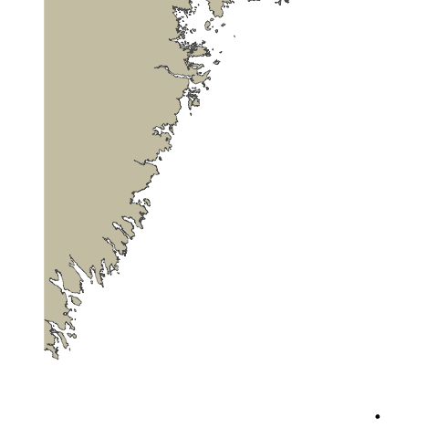

Basic animations using `gganimate` are great for many purposes but you will soon run into issues where your fish tracks are moving across land barriers, especially in more complex environments. This is because the `geom` used in the previous lesson choose the most direct path between two detection points. To avoid this we need to use a specific land avoidance tool. For our next animation we will use the `pathroutr` package which you can find out more about [here](https://jmlondon.github.io/pathroutr/). 

We will begin in much the same way we did for our basic animation lesson with getting our data ready, but things will differ when we start to use `pathroutr` since there are specific data formats expected.

### Preparing our Data 

Just as in the basic animations lesson, we will only look at one fish. We will also filter down the data and only look at **5 detection events** as an example subset due to the computational intensity of `pathroutr` and its calculations.

~~~
library(glatos)
library(sf)
library(gganimate)
library(tidyverse)
library(pathroutr)
library(ggspatial)
library(sp)
library(raster)
library(geodata)

detection_events <- #create detections event variable
  read_otn_detections('nsbs_matched_detections_2022.csv') %>% # reading detections
  false_detections(tf = 3600) %>%  #find false detections
  filter(passed_filter != FALSE) %>% 
  detection_events(location_col = 'station', time_sep=3600)

plot_data <- detection_events %>% 
  dplyr::select(animal_id, mean_longitude,mean_latitude, first_detection)

one_fish <- plot_data[plot_data$animal_id == "NSBS-1393342-2021-08-10",] 

~~~
{: .language-r}

There is one small tweak we are going to make that is not immediately intuitive, and which we're only doing for the sake of this lesson. The blue sharks in our dataset have not given us many opportunities to demonstrate `pathroutr`'s awareness of coastlines. In order to give you a fuller demonstration of the package, we are going to cheat and shift the data 0.5 degrees to the west, which brings it more into contact with the Nova Scotian coastline and lets us show off `pathroutr` more completely. You do not need to do this with your real data.

~~~
one_fish_shifted <- one_fish %>% mutate(mean_longitude_shifted = mean_longitude-0.5)
~~~
{: .language-r}

### Getting our Shapefile

The first big difference between our basic animation lesson and this lesson is that we will need a shapefile of the study area, so `pathroutr` can determine where the landmasses are located. To do this we will use the `gadm` function from the `geodata` library which gets administrative boundaries (i.e, borders) for anywhere in the world. The first argument we will pass to `gadm` is the name of the country we wish to get, in this case, Canada. We will specify `level` as 1, meaning we want our data to be subdivided at the first level after 'country' (in this case, provinces). 0 would get us a single shapefile of the entire country; 1 will get us individual shapefiles of each province. We must also provide a path for the downloaded shapes to be stored (`./geodata` here), and optionally a resolution. `gadm` only has two possible values for resolution: 1 for 'high' and 2 for 'low'. We'll use low resolution here because as we will see, for this plot it is good enough and will reduce the size of the data objects we download.

This is only one way to get a shapefile for our coastlines- you may find you prefer a different method. Regardless, this is the one we'll use for now. 

~~~
CAN<-gadm('CANADA', level=1, path="./geodata", resolution=2)
~~~
{: .language-r}

We only need one province, which we can select using the filtering methods common to R. 

~~~
shape_file <- CAN[CAN$NAME_1 == 'Nova Scotia',]
~~~
{: .language-r}

This shapefile is a great start, but we need the format to be an `sf` `multipolygon`. To do that we will run the `st_as_sf` function on our shapefile. We also want to change the coordinate reference system (CRS) of the file to a projected coordinate system since we will be mapping this plot flat. To do that we will run `st_transform` and provide it the value `5070`.

~~~
md_polygon <- st_as_sf(single_poly) %>% st_transform(5070)
~~~
{: .language-r}

### Formatting our Dataset

We will also need to make some changes to our detection data as well, in order to work with `pathroutr`. To start we will need to turn the path of our fish movements into a `SpatialPoints` format. To do that we will get the `deploy_long` and `deploy_lat` with `dplyr::select` and add them to a variable called `path`. 

Using the `SpatialPoints` function we will pass our new  `path` variable  and `CRS("+proj=longlat +datum=WGS84 +no_defs")` for the `proj4string` argument. Just like for our shapefile we will need to turn our path into an `sf` object by using the `st_as_sf` function and change the CRS to a projected coordinate system because we will be mapping it flat.

~~~
path <- one_fish_shifted %>%  dplyr::select(mean_longitude_shifted,mean_latitude)

path <- SpatialPoints(path, proj4string = CRS("+proj=longlat +datum=WGS84 +no_defs"))

path <-  st_as_sf(path)  %>% st_transform(5070)

~~~
{: .language-r}

We can do a quick plot to just check how things look at this stage and see if they are as expected.

~~~
ggplot() + 
  ggspatial::annotation_spatial(ns_polygon, fill = "cornsilk3", size = 0) +
  geom_point(data = path, aes(x=unlist(map(geometry,1)), y=unlist(map(geometry,2)))) +
  geom_path(data = path, aes(x=unlist(map(geometry,1)), y=unlist(map(geometry,2))))  +
  theme_void()
~~~
{: .language-r}

### Using `pathroutr`

Now that we have everything we need we can begin to use `pathroutr`. First, we will turn our path points into a `linestring` - this way we can use `st_sample` to sample points on our path.

~~~
plot_path <- path %>% summarise(do_union = FALSE) %>% st_cast('LINESTRING')

track_pts <- st_sample(plot_path, size = 10000, type = "regular")
~~~
{: .language-r}

The first `pathroutr` function we will use is `prt_visgraph`. This creates a visibility graph that connects all of the vertices for our shapefile with a Delaunay triangle mesh and removes any edges that cross land. You could think of this part as creating the viable routes an animal could swim through (marking the "water" as viable).

~~~
vis_graph <- prt_visgraph(ns_polygon, buffer = 150)
~~~
{: .language-r}

To reroute our paths around the landmasses we will call the `prt_reroute` function. Passing `track_pts`, `md_polygon`, and `vis_graph` as arguments. To have a fully updated path we can run the `prt_update_points` function, passing our new path `track_pts_fix` with our old path `track_pts`.

~~~
track_pts_fix <- prt_reroute(track_pts, ns_polygon, vis_graph, blend = TRUE)

track_pts_fix <- prt_update_points(track_pts_fix, track_pts)
~~~
{: .language-r}

Now with our newly fixed path we can visualize it and see how it looks. We can also use this plot as the base plot for our animation. 

For `geom_point` and `geom_path` we will pass in `track_pts_fix` for the `data` argument, but we will need to get a little creative for the `x` and `y` arguments in the aesthetic. `track_pts_fix` is a list of points so we will need a way to subset just the `x` and `y` values in order to supply them to the aesthetic. We will do this using `map(geometry,1)` to get a list of the values, and then `unlist` to turn that into a vector.

~~~
pathroutrplot <- ggplot() + 
  ggspatial::annotation_spatial(ns_polygon, fill = "cornsilk3", size = 0) +
  geom_point(data = track_pts_fix, aes(x=unlist(map(geometry,1)), y=unlist(map(geometry,2)))) +
  geom_path(data = track_pts_fix, aes(x=unlist(map(geometry,1)), y=unlist(map(geometry,2))))  +
  theme_void()

pathroutrplot
~~~
{: .language-r}

### Animating our New Path

With our plot in good order we are now able to animate! We will follow what we did in the basic animation lesson with updating our `pathroutrplot` variable by using it as the basemap, then adding extra information. Using the function `transition_reveal` and then `shadow_mark`, we will use the arguments of `past` equal to `TRUE` and `future` equal to `FALSE`. Then we are good to call the `gganimate::animate` function and watch our creation!

~~~
pathroutrplot.animation <-
  pathroutrplot +
  transition_reveal(fid) +
  shadow_mark(past = TRUE, future = FALSE)

gganimate::animate(pathroutrplot.animation, nframes=100, detail=2)
~~~
{: .language-r}

> ## A Note on Detail
>
> You'll note that the animation we've generated still crosses the landmass at certain points. This is a combination of several factors: our coastline polygon is not very high-res, our animation does not have many frames, and what frames it does have are not rendered in great detail. We can increase all of these and get a more accurate plot. For example:
> - We can specify `resolution=1` when downloading our shapefile from GADM.
> - We can increase the `nframes` variable in our call to `gganimate::animate`.
> - We can pass `detail = 2` or higher to the call to `gganimate::animate`.
>
> All of these will give us an animation that more scrupulously respects the landmass, however, they will all bloat the runtime of the code significantly. This may not be a consideration when you create your own animations, but they do make it impractical for this workshop. 
> Embedded below is an animation created with high-resolution polygons and animation parameters to show an example of the kind of animation we could create with more time and processing power. 
> 
{: .callout}