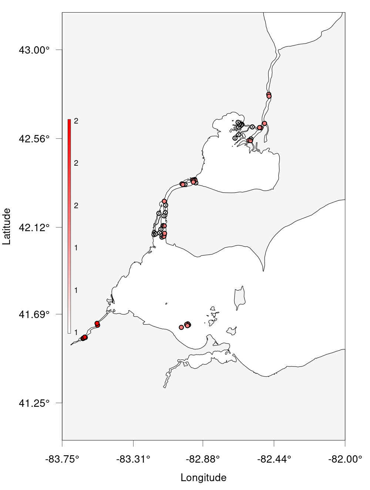

We can use glatos to quickly and effectively visualize our data, now that we've
cleaned it up.

One of the simplest ways is to use an abacus plot to display animal detections
against the appropriate stations.

~~~
# Visualizing Data - Abacus Plots ####
# ?glatos::abacus_plot
# customizable version of the standard VUE-derived abacus plots

abacus_plot(detections_w_events, 
            location_col='station', 
            main='ACT Detections by Station') # can use plot() variables here, they get passed thru to plot()

~~~
{: .language-r}

This is good, but cluttered. We can also filter out a single animal ID and plot
only the abacus plot for that.
~~~
# pick a single fish to plot
abacus_plot(detections_filtered[detections_filtered$animal_id== "PROJ58-1218508-2015-10-13",],
            location_col='station',
            main="PROJ58-1218508-2015-10-13 Detections By Station")
~~~
{: .language-r}

If we want to see actual physical distribution, a bubble plot will serve us better.

We'll use the Maryland raster `MD` from last lesson.
~~~
# Bubble Plots for Spatial Distribution of Fish ####
# bubble variable gets the summary data that was created to make the plot
detections_filtered

?detection_bubble_plot

bubble_station <- detection_bubble_plot(detections_filtered,

                                        background_ylim = c(38, 40),
                                        background_xlim = c(-77, -76),
                                        map = MD,
                                        location_col = 'station',
                                        out_file = 'act_bubbles_by_stations.png')
bubble_station

bubble_array <- detection_bubble_plot(detections_filtered,
                                      background_ylim = c(38, 40),
                                      background_xlim = c(-77, -76),
                                      map = MD,
                                      out_file = 'act_bubbles_by_array.png')
bubble_array
~~~
{: .language-r}

> ## Glatos Challenge
>
> Create a bubble plot of the station in Lake Erie only. Set the bounding box using the provided nw + se cordinates and
> resize the points. As a bonus, add points for the other receivers in Lake Erie.
> Hint: `?detection_bubble_plot` will help a lot.
> Here's some code to get you started:
> ~~~
> erie_arrays <-c("DRF", "DRL", "DRU", "MAU", "RAR", "SCL", "SCM", "TSR")
> nw <- c(43, -83.75)
> se <- c(41.25, -82)
> ~~~
> {: .language-r}
>
> > ## Solution
> >
> > ~~~
> > erie_arrays <-c("DRF", "DRL", "DRU", "MAU", "RAR", "SCL", "SCM", "TSR") # Given
> > nw <- c(43, -83.75) # Given
> > se <- c(41.25, -82) # Given
> > erie_detections <- detections_filtered %>% filter(glatos_array %in% erie_arrays)
> > erie_rcvrs <- receivers %>% filter(glatos_array %in% erie_arrays) # For bonus
> >
> > erie_bubble <- detection_bubble_plot(erie_detections,
> >                                      receiver_locs = erie_rcvrs, # For bonus
> >                                      location_col = 'station',
> >                                      background_ylim = c(se[1], nw[1]),
> >                                      background_xlim = c(nw[2], se[2]),
> >                                      symbol_radius = 0.75,
> >                                      out_file = 'erie_bubbles_by_stations.png')
> > ~~~
> > {: .language-r}
> > 
> {: .solution}
{: .challenge}
