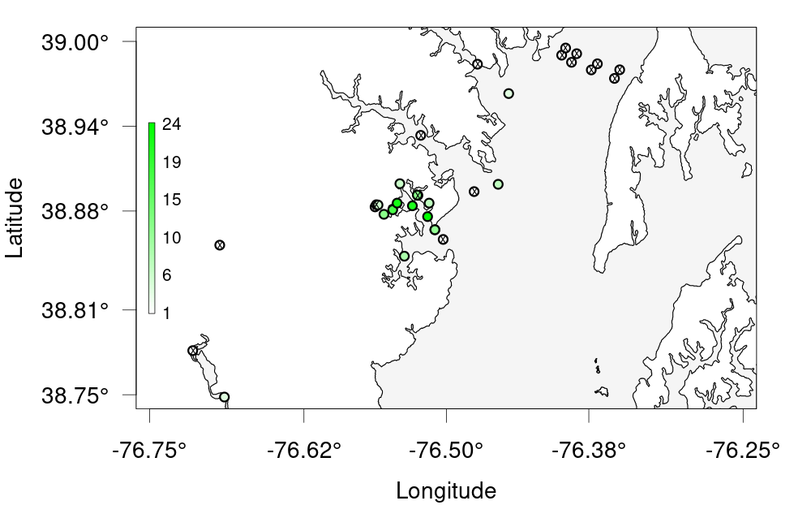

**Note to instructors: please choose the relevant Network below when teaching**

## ACT Node

Now that we've cleaned and processed our data, we can use `glatos`' built-in plotting tools to make quick and effective visualizations out of it. One of the simplest visualizations is an abacus plot to display animal detections against the appropriate stations. To this end, `glatos` supplies a built-in, customizable `abacus_plot` function.

~~~
# Visualizing Data - Abacus Plots ####
# ?glatos::abacus_plot
# customizable version of the standard VUE-derived abacus plots

abacus_plot(detections_w_events,
            location_col='station',
            main='ACT Detections by Station') # can use plot() variables here, they get passed thru to plot()

~~~
{: .language-r}

This is good, but you can see that the plot is cluttered. Rather than plotting our entire dataset, let's try filtering out a single animal ID and only plotting that. We can do this right in our call to `abacus_plot` with the filtering syntax we've previously covered.

~~~
# pick a single fish to plot
abacus_plot(detections_filtered[detections_filtered$animal_id== "PROJ58-1218508-2015-10-13",],
            location_col='station',
            main="PROJ58-1218508-2015-10-13 Detections By Station")
~~~
{: .language-r}

Other plots are available in `glatos` and can show different facets of our data. If we want to see the physical distribution of our stations, for example, a bubble plot will serve us better.

We'll continue to use the Maryland raster `MD` from last lesson. Remember that we need to provide a coastline shape to plot our data on top of.

~~~
# Bubble Plots for Spatial Distribution of Fish ####
# bubble variable gets the summary data that was created to make the plot
detections_filtered

?detection_bubble_plot

bubble_station <- detection_bubble_plot(detections_filtered,

                                        background_ylim = c(38, 40),
                                        background_xlim = c(-77, -76),
                                        map = MD,
                                        location_col = 'station',
                                        out_file = 'act_bubbles_by_stations.png')
bubble_station

bubble_array <- detection_bubble_plot(detections_filtered,
                                      background_ylim = c(38, 40),
                                      background_xlim = c(-77, -76),
                                      map = MD,
                                      out_file = 'act_bubbles_by_array.png')
bubble_array
~~~
{: .language-r}

These examples provide just a brief introduction to some of the plotting available in `glatos`.

> ## Glatos Challenge
>
> Challenge 1 ----
> Create a bubble plot of that bay we zoomed in earlier. Set the bounding box using the provided nw + se cordinates, change the colour scale and
> resize the points to be smaller. As a bonus, add points for the other receivers that don't have any detections.
> Hint: ?detection_bubble_plot will help a lot
> Here's some code to get you started
> ~~~
> nw <- c(38.75, -76.75) # given
> se <- c(39, -76.25) # given
> ~~~
> {: .language-r}
>
> > ## Solution
> >
> > ~~~
> > nw <- c(38.75, -76.75) # given
> > se <- c(39, -76.25) # given
> >
> > deploys <- read_otn_deployments('matos_FineToShare_stations_receivers_202104091205.csv') # For bonus
> > bubble_challenge <- detection_bubble_plot(detections_filtered,
> >                                      background_ylim = c(nw[1], se[1]),
> >                                      background_xlim = c(nw[2], se[2]),
> >                                      map = MD,
> >                                      symbol_radius = 0.75,
> >                                      location_col = 'station',
> >                                      col_grad = c('white', 'green'),
> >                                      receiver_locs = deploys, # For bonus
> >                                      out_file = 'act_bubbles_challenge.png')
> > ~~~
> > {: .language-r}
> > 
> {: .solution}
{: .challenge}

## FACT Node

Now that we've cleaned and processed our data, we can use `glatos`' built-in plotting tools to make quick and effective visualizations out of it. One of the simplest visualizations is an abacus plot to display animal detections against the appropriate stations. To this end, `glatos` supplies a built-in, customizable `abacus_plot` function.

~~~
# Visualizing Data - Abacus Plots ####
# ?glatos::abacus_plot
# customizable version of the standard VUE-derived abacus plots

abacus_plot(detections_w_events,
            location_col='station',
            main='TQCS Detections by Station') # can use plot() variables here, they get passed thru to plot()

~~~
{: .language-r}

This is good, but you can see that the plot is cluttered. Rather than plotting our entire dataset, let's try filtering out a single animal ID and only plotting that. We can do this right in our call to `abacus_plot` with the filtering syntax we've previously covered.

~~~
# pick a single fish to plot
abacus_plot(detections_filtered[detections_filtered$animal_id=="TQCS-1049273-2008-02-28",],
            location_col='station',
            main="TQCS-1049273-2008-02-28 Detections By Station")
~~~
{: .language-r}

Other plots are available in `glatos` and can show different facets of our data. If we want to see the physical distribution of our stations, for example, a bubble plot will serve us better.

We'll continue to use the Florida raster `FL` from last lesson. Remember that we need to provide a coastline shape to plot our data on top of.

~~~
# Bubble Plots for Spatial Distribution of Fish ####
# bubble variable gets the summary data that was created to make the plot
detections_filtered

?detection_bubble_plot

bubble_station <- detection_bubble_plot(detections_filtered,
                                out_file = '../tqcs_bubble.png',
                                location_col = 'station',
                                map = FL,
                                col_grad=c('white', 'green'),
                                background_xlim = c(-81, -80),
                                background_ylim = c(26, 28))
bubble_station

bubble_array <- detection_bubble_plot(detections_filtered,
                                      background_xlim = c(-81, -80),
                                      background_ylim = c(26, 28),
                                      map = FL,
                                      out_file = 'act_bubbles_by_array.png')
bubble_array
~~~
{: .language-r}

These examples provide just a brief introduction to some of the plotting available in `glatos`.

> ## Glatos FACT Challenge
>
> Challenge 1 ----
> Create a bubble plot of that bay we zoomed in earlier. Set the bounding box using the provided nw + se cordinates, change the colour scale and
> resize the points to be smaller. As a bonus, add points for the other receivers that don't have any detections.
> Hint: ?detection_bubble_plot will help a lot
> Here's some code to get you started
> ~~~
> nw <- c(-81, -80) # given
> se <- c(26, 28) # given
> ~~~
> {: .language-r}
>
> > ## Solution
> >
> > ~~~
> > nw <- c(38.75, -76.75) # given
> > se <- c(39, -76.25) # given
> >
> > bubble_challenge <- detection_bubble_plot(detections_filtered,
> >                                      background_ylim = c(nw[1], se[1]),
> >                                      background_xlim = c(nw[2], se[2]),
> >                                      map = FL,
> >                                      symbol_radius = 0.75,
> >                                      location_col = 'station',
> >                                      col_grad = c('white', 'green'),
> >                                      receiver_locs = receivers, # For bonus
> >                                      out_file = 'fact_bubbles_challenge.png')
> > ~~~
> > {: .language-r}
> {: .solution}
{: .challenge}

## GLATOS Network

Now that we've cleaned and processed our data, we can use `glatos`' built-in plotting tools to make quick and effective visualizations out of it. One of the simplest visualizations is an abacus plot to display animal detections against the appropriate stations. To this end, `glatos` supplies a built-in, customizable `abacus_plot` function.

~~~
# Visualizing Data - Abacus Plots ####
# ?glatos::abacus_plot
# customizable version of the standard VUE-derived abacus plots

abacus_plot(detections_w_events,
            location_col='station',
            main='TQCS Detections by Station') # can use plot() variables here, they get passed thru to plot()

~~~
{: .language-r}

This is good, but you can see that the plot is cluttered. Rather than plotting our entire dataset, let's try filtering out a single animal ID and only plotting that. We can do this right in our call to `abacus_plot` with the filtering syntax we've previously covered.

~~~
# pick a single fish to plot
abacus_plot(detections_filtered[detections_filtered$animal_id=="22",],
            location_col='station',
            main="Animal 22 Detections By Station")
~~~
{: .language-r}

Other plots are available in `glatos` and can show different facets of our data. If we want to see the physical distribution of our stations, for example, a bubble plot will serve us better.

~~~
# Bubble Plots for Spatial Distribution of Fish ####
# bubble variable gets the summary data that was created to make the plot
?detection_bubble_plot

bubble_station <- detection_bubble_plot(detections_filtered,
                                location_col = 'station',
                                out_file = 'walleye_bubbles_by_stations.png')
bubble_station

bubble_array <- detection_bubble_plot(detections_filtered,
                                      out_file = 'walleye_bubbles_by_array.png')
bubble_array
~~~
{: .language-r}

These examples provide just a brief introduction to some of the plotting available in `glatos`.

> Challenge 1 ----
> Create a bubble plot of the station in Lake Erie only. Set the bounding box using the provided nw + se cordinates and
> resize the points. As a bonus, add points for the other receivers in Lake Erie.
> Hint: ?detection_bubble_plot will help a lot
> Here's some code to get you started
> erie_arrays <-c("DRF", "DRL", "DRU", "MAU", "RAR", "SCL", "SCM", "TSR") #given
> nw <- c(43, -83.75) #given
> se <- c(41.25, -82) #given
> >
> > bubble_challenge <- detection_bubble_plot(detections_filtered,
> >                                      background_ylim = c(nw[1], se[1]),
> >                                      background_xlim = c(nw[2], se[2]),
> >                                      symbol_radius = 0.75,
> >                                      location_col = 'station',
> >                                      col_grad = c('white', 'green'),
> >                                      out_file = 'glatos_bubbles_challenge.png')
> > ~~~
> > {: .language-r}
> {: .solution}
{: .challenge}
