`actel` is designed for studies where animals tagged with acoustic tags are expected to move through receiver arrays. `actel` combines the advantages of automatic sorting and checking of animal movements with the possibility for user intervention on tags that deviate from expected behaviour. The three analysis functions: explore, migration and residency, allow the users to analyse their data in a systematic way, making it easy to compare results from different studies.

Author: Dr. Hugo Flavio, ( hflavio@wlu.ca )

Actel on GitHub: https://github.com/hugomflavio/actel/

- [PAPER - actel: Standardised analysis of acoustic telemetry data from animals moving through receiver arrays](../Resources/actel_paper_published_version.pdf)

- [POWERPOINT](../Resources/actel_introduction.ppsx)


### Actel - a package for the analysis of acoustic telemetry data

`actel` seeks to be a one-stop package that guides the user through the compilation and cleaning of their telemetry data, the description of their study system, and the production of many reports and analyses that are generally applicable to closed-system telemetry projects. `actel` tracks receiver deployments, tag releases, and detection data, as well as an additional concept of receiver groups and a network of the interconnectivity between them within our study area, and uses all of this information to raise warnings and potential oddities in the detection data to the user.

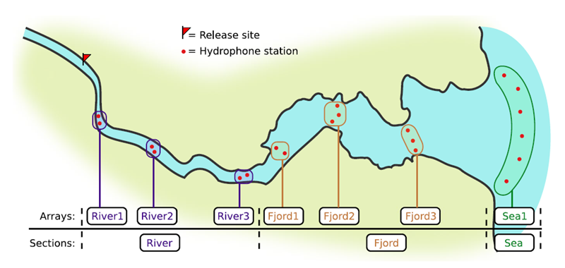


If you're working in river systems, you've probably got a sense of which receivers form arrays. There is a larger-order grouping you can make called 'sections', and this will be something we can inter-compare our results with.

### Preparing to use `actel`

With our receiver, tag, and detection data mapped to `actel`'s formats, and after creating our receiver groups and graphing out how detected animals may move between them, we can leverage `actel`'s analyses for our own datasets. Thanks to some efforts on the part of Hugo and of the `glatos` development team, we can move fairly easily with our `glatos` data into `actel`.

`actel`'s standard suite of analyses are grouped into three main functions - explore(), migration(), and residency(). As we will see in this and the next modules, these functions specialize in terms of their outputs but accept the same input data and arguments.

The first thing we will do is use `actel`'s built-in dataset to ensure we've got a working environment, and also to see what sorts of default analysis output Actel can give us.


### Exploring

~~~
library("actel")

# The first thing you want to do when you try out a package is...
# explore the documentation!

# See the package level documentation:
?actel

# See the manual:
browseVignettes("actel")

# Get the citation for actel, and access the paper:
citation("actel")

# Finally, every function in actel contains detailed documentation
# of the function's purpose and parameters. You can access this
# documentation by typing a question mark before the function name.
# e.g.: ?explore
~~~
{: .language-r}

## Working with `actel`'s example dataset

~~~
# Start by checking where your working directory is (it is always good to know this)
getwd()

# We will then deploy actel's example files into a new folder, called "actel_example".
# exampleWorkspace() will provide you with some information about how to run the example analysis.
exampleWorkspace("actel_example")

# Side note: When preparing your own data, you can create the initial template files
# with the function createWorkspace("directory_name")

# Take a minute to explore this folder's contents.

# -----------------------
~~~
{: .language-r}

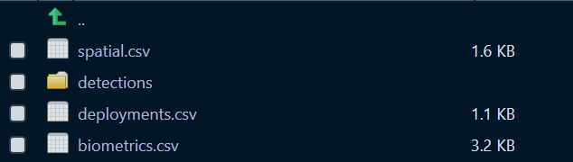

These are the files the Actel package depends on to create its output plots and result summary files.

biometrics.csv contains the detailed information on your tagged animals, where they were released and when, what the tag code is for that animal, and a grouping variable for you to set. Additional columns can be part of biometrics.csv but these are the minimum requirements. The names of our release sites must match up to a place in our spatial.csv file, where you release the animal has a bearing on how it will begin to interact with your study area.

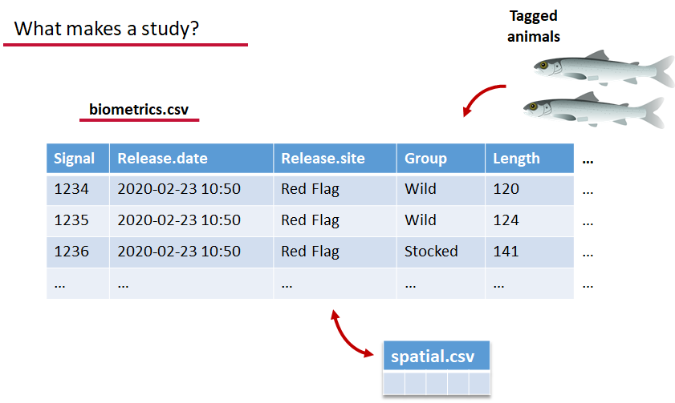

deployments.csv concerns your receiver deployments, when and where each receiver by serial number was deployed. Here again you can have more than the required columns but you have to have a column that corresponds to the station's 'name', which will have a paired entry in the spatial.csv file as well, and a start and end time for the deployment.

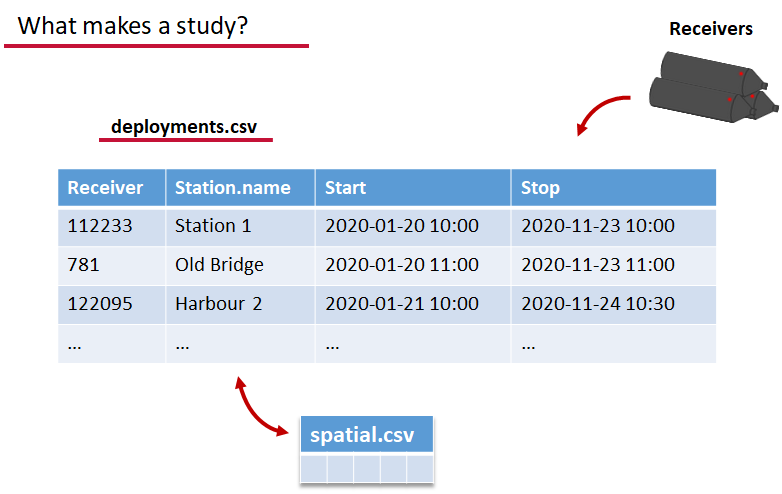

Finally, we have to have some number of detection files. This is helpfully a folder to make it easier on folks who don't have aggregators like GLATOS and OTN to pull together all the detection information for their tags. While we could drop our detection data in here, when the time comes to use GLATOS data with `actel` we'll see how we can create these data structures straight from the `glatos` data objects. Here also Hugo likes to warn people about opening their detection data files in Excel directly... Excel's eaten a few date fields on all of us, I'm sure. We don't have a hate-on for Excel or anything, like our beloved household pet, we've just had to learn there are certain places we just can't bring it with us.

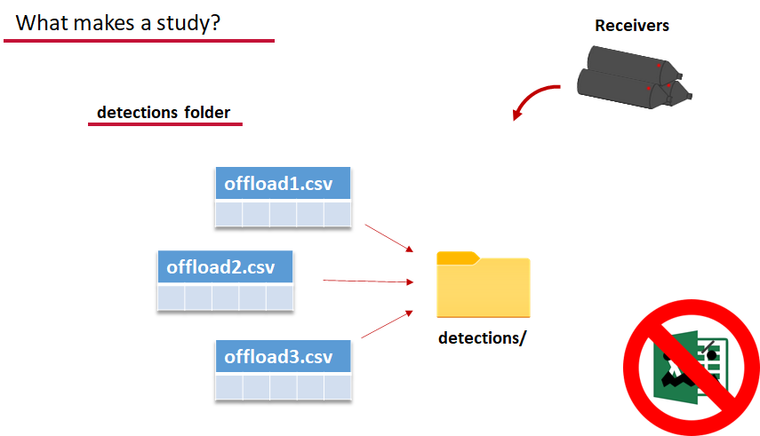


OK, now we have a biometrics file of our tag releases with names for each place we released our tags in spatial.csv, we have a deployments file of all our receiver deployments and the matching names in spatial.csv, and we've got our detections. These are the minimum components necessary for `actel` to go to work.

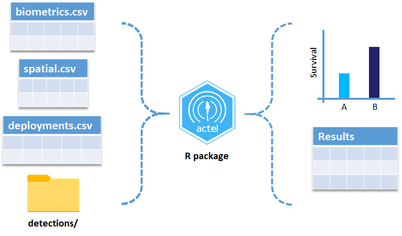


~~~
# move into the newly created folder
setwd('actel_example')

# Run analysis. Note: This will open an analysis report on your web browser.
exp.results <- explore(tz = 'US/Central', report = TRUE)

# Because this is an example dataset, this analysis will run very smoothly. 
# Real data is not always this nice to us!

# ----------
# If your analysis failed while compiling the report, you can load 
# the saved results back in using the dataToList() function:
exp.results <- dataToList("actel_explore_results.RData")

# If your analysis failed before you had a chance to save the results,
# load the pre-compiled results, so you can keep up with the workshop.
# Remember to change the path so R can find the RData file.
exp.results <- dataToList("pre-compiled_results.RData")
~~~
{: .language-r}

This example dataset is a salmon project working in a river-and-estuary system in northeastern Denmark. There are lots of clear logical separations in the array design and the general geography here that we will want to compare and deal with separately.

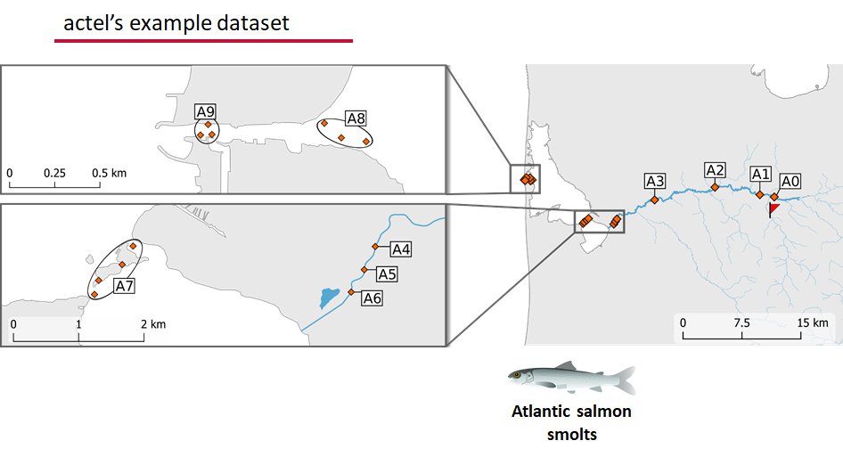


### Exploring the output of `explore()`

~~~
# What is inside the output?
names(exp.results)

# What is inside the valid movements?
names(exp.results$valid.movements)

# let's have a look at the first one:
exp.results$valid.movements[["R64K-4451"]]

# and here are the respective valid detections:
exp.results$valid.detections[["R64K-4451"]]

# We can use these results to obtain our own plots (We will go into that later)
~~~
{: .language-r}


These files are the minimum requirements for the main analyses, but there are more files we can create that will give us more control over how `actel` sees our study area.

A good deal of checking occurs when you first run any analysis function against your data files, and `actel` is designed to step through any problems interactively with you and prompt you for the preferred resolutions. These interactions can be saved as plaintext in your R script if you want to remember your choices, or you can optionally clean up the input files directly and re-run the analysis function.

#### Checks that `actel` runs:

Actel will calculate the movement path for each individual animal, and determine whether that animal has met a threshhold for minimum detections and detection events, whether it snuck across arrays that should have detected it but didn't, whether it reached unlikely speeds or crossed impassable areas

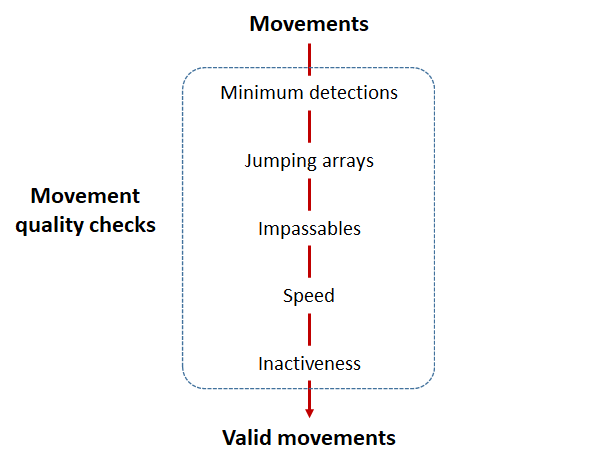


**Minimum detections:**

Controlled by the `minimum.detections` and `max.interval` arguments, if a tag has only 1 movement with less than `n` detections, discard the tag. Note that animals with movement events > 1 will pass this filter regardless of `n`.

**Jumping arrays:**

In cases where you have gates of arrays designed to capture all movement up and down a linear system, you may want to verify that your tags have not 'jumped' past one or more arrays before being re-detected. You can use the `jump.warning` and `jump.error` arguments to `explore()` to set the number of acceptable jumps across your array system are permissible.

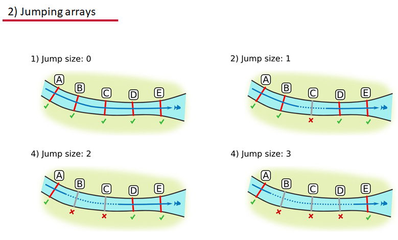

**Impassables:**
When we define how our areas are connected in the spatial.txt file, it tells `actel` which movements are -not- permitted explicitly, and can tell us about when those movements occur. This way, we can account for manmade obstacles or make other assumptions about one-way movement and verify our data against them.

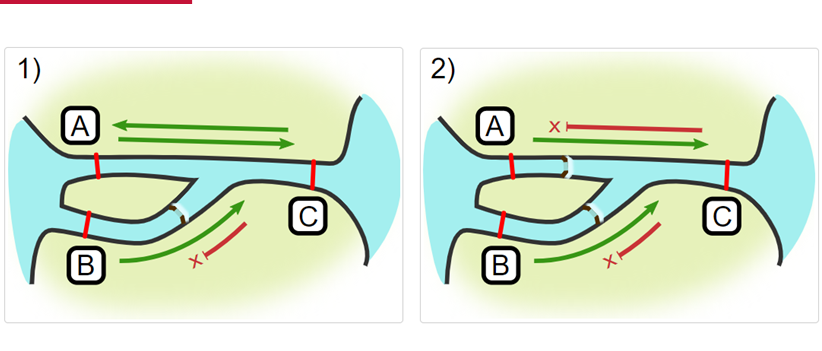

**Speed:**

`actel` can calculate the minimum speed of an animal between (and optionally within) detection events using the distances calculated from spatial.csv into a new distance matrix file, distances.csv, and we can supply `speed.warning`, `speed.error`, and `speed.method` to tailor our report to the speed and calculation method we want to submit our data to.

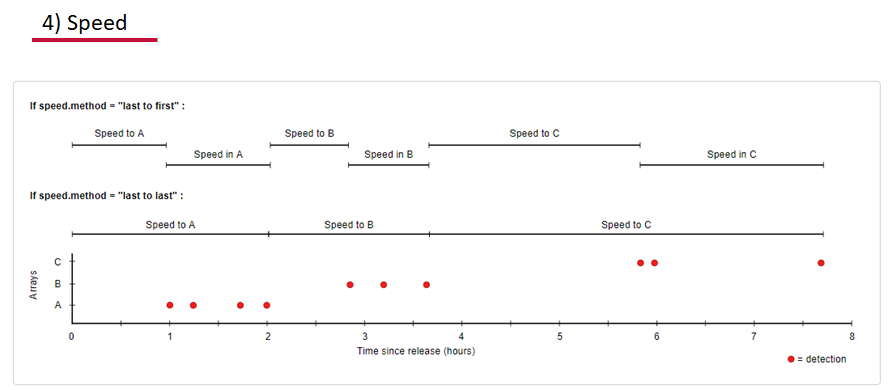


**Inactivity:**

With the `inactive.warning` and `inactive.error` arguments, we can flag entries that have spent a longer time than expected not transiting between locations.

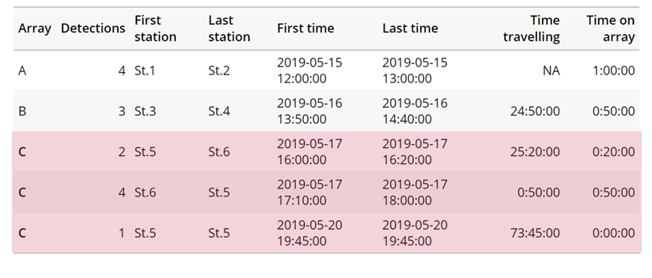


### Creating a spatial.txt file

Your study area might be simple and linear, may be complicated and open, completely interconnected. It is more likely a combination of the two! We can use [DOT notation](https://graphs.grevian.org/example) (commonly used in graphing applications like [GraphViz](https://graphviz.org/doc/info/lang.html) and [Gephi](https://gephi.org/users/supported-graph-formats/graphviz-dot-format/)) to create a graph of our areas and how they are allowed to inter-mingle. `actel` can read this information as DOT notation using `readDOT()` or you can provide a spatial.txt with the DOT information already inline.

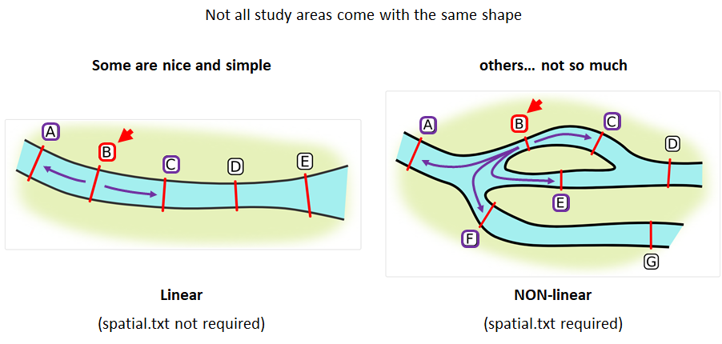

The question you must ask when creating spatial.txt files is: for each location, where could my animal move to and be detected next?


The DOT for the simple system on the left is: 

```
A -- B -- C -- D -- E
```


And for the more complicated system on the right it's
```
A -- B -- C -- D
A -- E -- D
A -- F -- G
B -- E -- F
B -- F
C -- E 
```

> #### Challenge : DOT notation
>Using the DOT notation tutorial linked [here](https://graphs.grevian.org/example), discover the notation for a one-way connection and write the DOT notations for the systems shown here:
>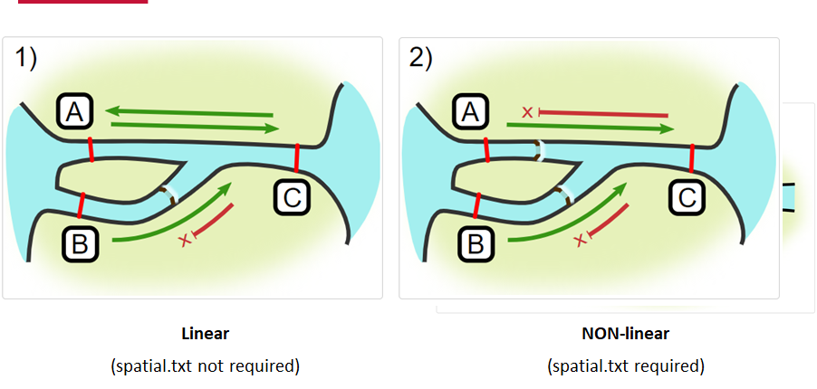
>> #### Solution:
>> **Left-hand diagram**:
>> ~~~
>> A -- B
>> A -- C
>> B -> C
>> ~~~
>> **Right-hand diagram**:
>> ~~~
>>A -- B
>>A -> C
>>B -> C
>> ~~~
>{: .solution}
{: .challenge}


### Generating an initial distance matrix file

A distance matrix tracks the distance between each pair of spatial data points in a dataframe. In `actel`, our dataframe is spatial.csv, and we can use this datafile as well as a shapefile describing our body or bodies of water, with the functions `loadShape()`, `transitionLayer()` and `distancesMatrix()` to generate a distance matrix for our study area.

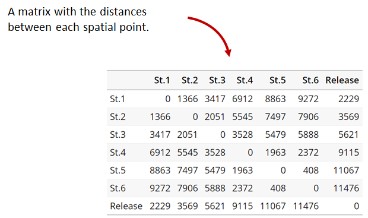

Let's use `actel`'s built-in functions to create a distance matrix file. The process generally will be:

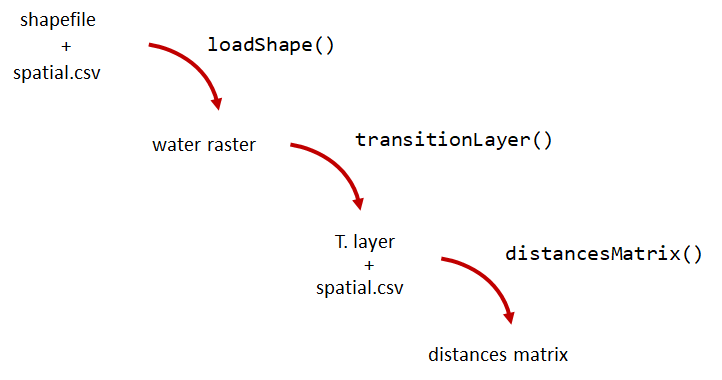

~~~
# Let's load the spatial file individually, so we can have a look at it.
spatial <- loadSpatial()
head(spatial)

# When doing the following steps, it is imperative that the coordinate reference 
# system (CRS) of the shapefile and of the points in the spatial file are the same.
# In this case, the values in columns "x" and "y" are already in the right CRS.

# loadShape will rasterize the input shape, using the "size" argument as a reference
# for the pixel size. Note: The units of the "size" will be the same as the units
# of the shapefile projection (i.e. metres for metric projections, and degrees for latlong systems)
#
# In this case, we are using a metric system, so we are saying that we want the pixel
# size to be 10 metres.
#
# NOTE: Change the 'path' to the folder where you have the shape file.
# ^^^^^^^^^^^^^^^^^^^^^^^^^^^^^^^^^^^^^^^^^^^^^^^^^^^^^^^^^^^^^^^^^^^^
water <- loadShape(path = "replace/with/path/to/shapefile",
									 shape = "stora_shape_epsg32632.shp", size = 10,
									 coord.x = "x", coord.y = "y")

# The function above can run without the coord.x and coord.y arguments. However, by including them,
# you are allowing actel to load the spatial.csv file on the fly and check if the spatial points
# (i.e. hydrophone stations and release sites) are positioned in water. This is very important,
# as any point position on land will be cut off during distance calculations.

# Now we need to create a transition layer, which R will use to estimate the distances
tl <- transitionLayer(water)

# We are ready to try it out! distancesMatrix will automatically search for a "spatial.csv"
# file in the current directory, so remember to keep that file up to date!
dist.mat <- distancesMatrix(tl, coord.x = "x", coord.y = "y")

# have a look at it:
dist.mat
~~~
{: .language-r}

## migration and residency

`migration()` runs the same checks as `explore()` and can be advantageous in cases where your animals can be assumed to be moving predictably.

 The built-in vignettes (remember: ` browseVignettes("actel")` for the interactive vignette) are the most comprehensive description of all that `migration()` offers over and above `explore()` but one good way might be to examine its output. For simple datasets and study areas like our example dataset, the arguments and extra spatial.txt and distances.csv aren't necessary. Our mileage may vary.


~~~
# Let's go ahead and try running migration() on this dataset.
mig.results <- migration(tz = 'Europe/Copenhagen', report = TRUE)
~~~
{: .language-r}

the `migration()` function will ask us to invalidate some flagged data or leave it in the analysis, and then it will ask us to save a copy of the source data once we've cleared all the flags. Then we get to see the report. It will show us things like our study locations and their graph relationship:


... a breakdown of the biometrics variables it finds in biometrics.csv

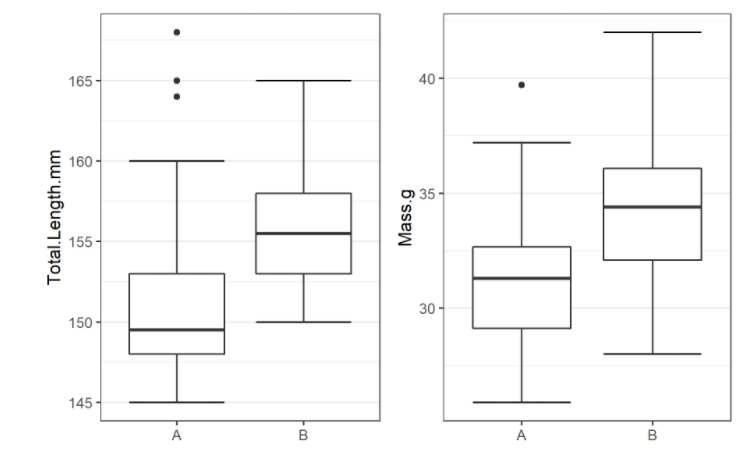 

... and a temporal analysis of when animals arrived at each of the array sections of the study area.

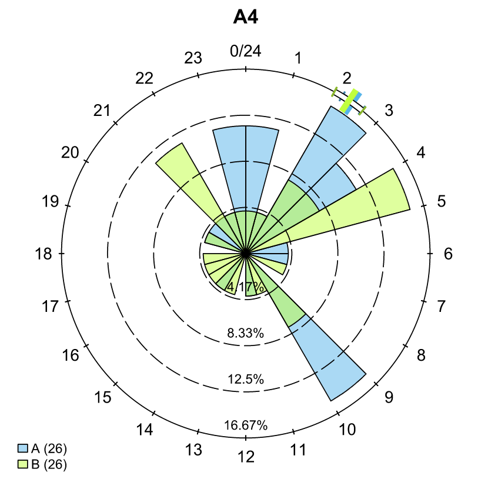


To save our choices in `actel`'s interactives, let's include them as raw text in our R block. We'll test this by calling `residency()` with a few pre-recorded choices, as below:

~~~
# Try copy-pasting the next five lines as a block and run it all at once.
res.results <- residency(tz = 'Europe/Copenhagen', report = TRUE)
comment
This is a lovely fish
n
y
# R will know to answer each of the questions that pop up during the analysis
# with the lines you copy-pasted together with your code!

# explore the reports to see what's new!

# Note: There is a known bug in residency() as of actel 1.2.0, which for some datasets
# will cause a crash with the following error message:
#
# Error in tableInteraction(moves = secmoves, tag = tag, trigger = the.warning,  : 
#  argument "save.tables.locally" is missing, with no default
#
# This has already been corrected in development and a fix has been released in actel 1.2.1.

~~~
{: .language-r}

## Further exploration of `actel`: Transforming the results
~~~
# Try some of the stuff in this manual page!
vignette("f-0_post_functions", "actel")
~~~
{: .language-r}
