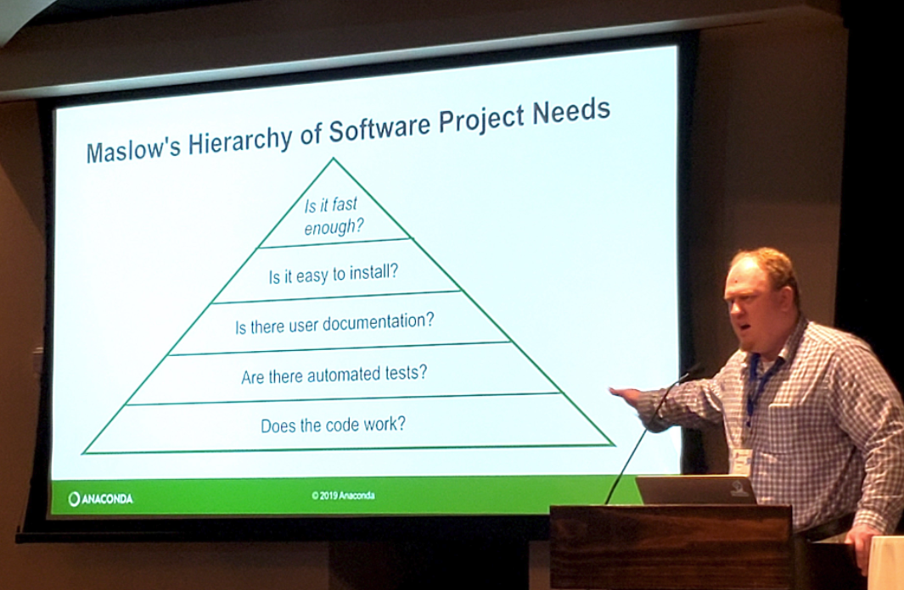

* How do I find packages to use?
    - CRAN, GitHub, literature
* How do I learn the right way to use them?
    - vignettes that are legible and show me how this package fits my workflow
* Checking the Pulse of a Package
    - Open source? Regular updates? Tickets being submitted, addressed, and resolved?
* Can I cite this thing?
    - Does it have a version number? An introductory publication / white paper? a vignette that describes the preferred citation method?
* Maslow's Hierarchy of Software Package Needs
    - Stanley Siebert of the Anaconda Project updated a very familiar diagram with what is important to software developers adopting software generally.

    

<!--  [Powerpoint](../Resources/TBD.pptx)
-->